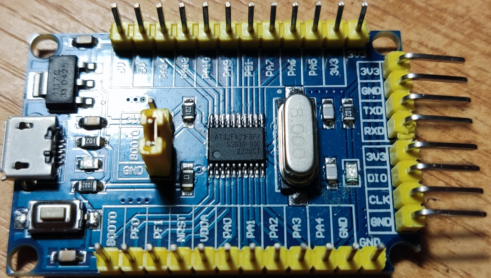

# AT32F421 Bare-Metal PWM Demo with Event-Driven Low-Power Loop

This project demonstrates a minimal, high-performance, and low-power application for the Artery AT32F421 microcontroller. It is written in pure C with direct register access, avoiding vendor HAL libraries to achieve maximum efficiency and a small footprint.

The core of the application is an event-driven main loop that uses the ARM core's `WFE` (Wait For Event) instruction to sleep, demonstrating an interrupt-less, low-power architecture suitable for event-based systems.

## Hardware and Toolchain

The hardware for this project is a generic STM32F030F4P6 "blue pill" style development board, commonly found on AliExpress. The original STM32 microcontroller was desoldered and replaced with a pin-compatible **Artery AT32F421F8P7** (TSSOP-20 package).

This modification allows for leveraging the higher performance of the Artery MCU on a cheap and widely available development board.



*   **Microcontroller**: Artery AT32F421F8P7 (ARM Cortex-M4).
*   **Toolchain**: GNU Arm Embedded Toolchain (`arm-none-eabi-gcc`).
*   **Debugger**: Any SWD-compatible probe (e.g., J-Link, DAP-Link).

### Pinout

*   `PA4`: TMR14_CH1 - PWM Output.
*   `PA9`: USART1_TX.
*   `PA10`: USART1_RX.
*   `PA13`/`PA14`: SWDIO/SWCLK for debugging.

## Key Features

*   **Event-Driven, Low-Power Core**: The main loop is driven by timer events and sleeps using `WFE`, consuming minimal power while waiting.
*   **Interrupt-less Wake-up**: Utilizes the `SEVONPEND` feature to wake the core from sleep via timer events without executing a full Interrupt Service Routine (ISR).
*   **Centralized Clock Management**: A robust `crm` module configures the system clock (up to 120MHz/125MHz) from either the internal HICK or an external crystal (HEXT). All peripheral clock calculations are derived automatically.
*   **Direct Register Access**: All peripherals (GPIO, Timers, USART) are configured via direct register writes for maximum performance and code transparency.
*   **Zero Standard Library Dependencies**: Includes a lightweight, custom `usart_putuint` and `usart_puts` for serial output, removing the need for `stdio.h`.
*   **Automated Toolchain Setup**: A shell script (`setup_project.sh`) downloads the necessary CMSIS and Artery library files and patches them for the project.
*   **Configurable Peripherals via Macros**: Easily configure PWM frequency, duty cycle, and USART baud rate by defining macros in the respective header files (`timer.h`, `usart.h`).

## Architecture

The software architecture is designed around a single, event-driven `while(1)` loop in `main.c`.

1.  **System Initialization**: `system_init()` orchestrates the configuration of all hardware:
    *   `crm_config()`: Sets up the system clock (e.g., 120MHz PLL) and enables peripheral clocks.
    *   `gpio_config()`: Configures GPIO pins for PWM output (PA4) and USART (PA9/PA10).
    *   `timer_config()`: Configures TMR14 to generate a PWM signal and periodic update events.
    *   `usart_config()`: Initializes USART1 for debug message output.
2.  **Event-Driven Main Loop**:
    *   The core enters a low-power sleep state by executing the `WFE` instruction.
    *   TMR14 is configured to generate an update event at a fixed frequency.
    *   The `SEVONPEND` bit in the `SCR` register is enabled, which causes the pending timer event to signal the core and wake it from the `WFE` state.
    *   The loop wakes up, checks the timer's flag, prints runtime statistics over USART, and goes back to sleep.

This model avoids the overhead of ISRs for simple periodic tasks, providing a highly efficient and predictable system.

## How to Build and Run

### 1. Dependencies

You need `wget` and a standard Unix-like environment to run the setup script. Ensure the `arm-none-eabi-gcc` toolchain is in your system's PATH.

### 2. Project Setup

Run the provided shell script to download the required library files:

```
sh setup_project.sh
```

This script will:
*   Create the `inc/` directory.
*   Download the necessary CMSIS core files, Artery device headers, and driver files into it.
*   Create a project-specific `at32f421_conf.h` from a template, enabling only the modules used (`CRM`, `TMR`, `USART`, `GPIO`, `FLASH`).
*   Patch the `startup_at32f421.s` file to comment out the `__libc_init_array` call, as we are not using the standard C library.

### 3. Configuration

You can customize the application's behavior by editing the header files before compiling:

*   **System Clock**: To use an external crystal, define `HEXT_FREQUENCY` in `crm.h`. If left undefined, it defaults to the internal HICK clock.
    ```
    // file: crm.h
    #define HEXT_FREQUENCY 8 // Use an 8MHz external crystal
    ```
*   **PWM Signal**: Set the PWM frequency and duty cycle in `timer.h`.
    ```
    // file: timer.h
    #define PWM_FREQUENCY_HZ 1 // 1 Hz
    #define PWM_DUTY_RATIO   50 // 50% duty cycle
    ```
*   **Baud Rate**: Change the USART baud rate in `usart.h`.
    ```
    // file: usart.h
    #define USART_BAUDRATE 115200
    ```

### 4. Compilation & Flashing

Compile the source files using your project's Makefile or build system, linking against the downloaded startup files and linker script. Flash the resulting `.elf` or `.bin` file to your AT32F421 board.

Connect a serial-to-USB adapter to PA9/PA10 to view the output. The application will print system info on startup and then periodic runtime statistics.

## File Structure

*   `main.c`: Contains the main application logic, initialization sequence, and the event-driven loop.
*   `setup_project.sh`: Script to automate the download and configuration of library files.
*   **Configuration Headers**:
    *   `crm.h`: Clock configuration, PLL settings, and peripheral clock enabling.
    *   `gpio.h`: GPIO pin alternate function and mode definitions.
    *   `timer.h`: TMR14 configuration for PWM and event generation.
    *   `usart.h`: USART configuration and baud rate calculation.
*   **Implementation Files**:
    *   `crm.c`: Logic for initializing the system clock.
    *   `gpio.c`: Single function to configure all GPIO pins.
    *   `timer.c`: Logic for configuring TMR14 registers.
    *   `usart.c`: USART initialization and lightweight character/string/integer printing functions.
